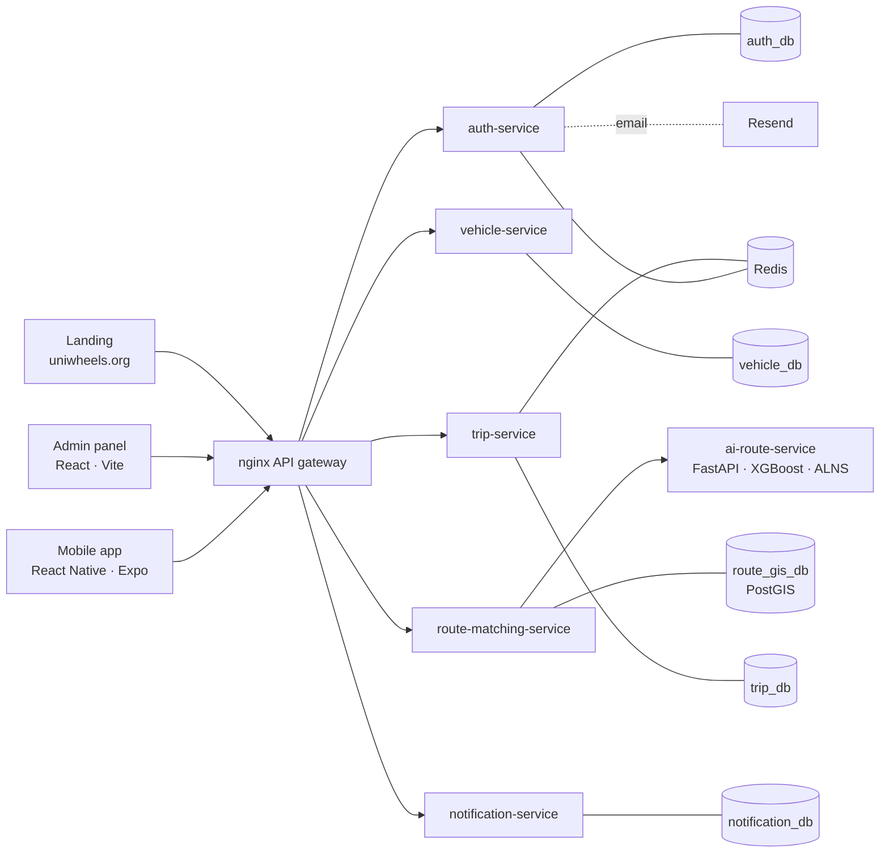

# UniWheels

**Verified carpooling for university communities.** Drivers publish the route they already drive to campus; passengers heading the same way get matched along it, and ride with people from their own university.

🌐 **Live:** [uniwheels.org](https://uniwheels.org) · 🛠️ **Admin panel:** [admin.uniwheels.org](https://admin.uniwheels.org) · 📱 **Mobile app:** React Native (Expo)

> Built end to end by one developer as a capstone project for a B.S. in Systems Engineering, and running in production.

---

## Highlights

- **5 Laravel 13 microservices + 1 FastAPI ML service**, each with its own PostgreSQL database, behind an **nginx API gateway**.
- **Geospatial matching** with **PostGIS**: routes stored as `LineString` geometries, GiST indexes, and `ST_DWithin` to find drivers passing near a passenger.
- **ETA prediction** with **scikit-learn / XGBoost**, plus a route optimizer (ALNS for a multi-passenger dial-a-ride problem) served through FastAPI.
- **Shared JWT auth** across services; account suspension propagated to every service through **Redis**.
- **Driver verification workflow**: document uploads (license, insurance, vehicle inspection), reviewed in a **React + Vite admin panel**, served via short-lived signed URLs.
- **Transactional email** with Resend (SPF, DKIM and DMARC configured).
- **~190 automated tests** (Pest/PHPUnit + pytest) running in **GitHub Actions CI**.
- Deployed with **Docker Compose on an Azure VM**, behind Cloudflare DNS.

## Architecture



| Service | Stack | Responsibility |
| :--- | :--- | :--- |
| `auth-service` | Laravel 13 · PHP 8.3 | Sign-up with institutional email + PIN verification, JWT issuing, roles, account deletion (Colombian data-protection law) |
| `vehicle-service` | Laravel 13 · PHP 8.3 | Cars and motorcycles, NHTSA vPIC catalog, legal documents, admin review flow |
| `route-matching-service` | Laravel 13 · PHP 8.3 · PostGIS | Route geometries, spatial indexing, detour evaluation, suggested fares |
| `trip-service` | Laravel 13 · PHP 8.3 | Trip state machine (requested → assigned → in progress with PIN check → completed), cancellations, late-cancellation tracking with automatic 30-day suspension |
| `notification-service` | Laravel 13 · PHP 8.3 | Two-way ratings, safety reports, in-app and push notifications |
| `ai-route-service` | Python · FastAPI | ETA prediction (XGBoost), ALNS route optimization, traffic data |

## Business model

B2B for universities: the institution pays for a license, and the platform is free for its community. The platform never processes payments. Drivers set a per-seat contribution capped by a suggested value (car COP 2,000 + 400/km, motorcycle COP 1,000 + 250/km), which passengers pay directly to the driver outside the app. See [ADR 0001](docs/adr/0001-pivote-b2b-sin-pagos.md).

## Key design decisions

- **Database per service.** Each service owns its schema, so services can be deployed and migrated independently. Trade-off: no cross-service joins; data is exchanged through APIs and events.
- **Stateless JWT shared across services** instead of a session store, so any service can authorize a request on its own. Revocation (e.g. suspending an account) is handled with a Redis blocklist that every service checks.
- **Spatial matching in the database.** PostGIS with GiST indexes answers "which routes pass within X meters of this point" in milliseconds, instead of computing distances in application code.
- **Map in a WebView (Leaflet)** on mobile instead of native map SDKs: one map implementation, no per-platform API keys, simpler upgrades.

## Tech stack

**Backend:** PHP 8.3, Laravel 13, Pest · Python, FastAPI, scikit-learn, XGBoost
**Data:** PostgreSQL 16, PostGIS, Redis
**Frontend & mobile:** TypeScript, React 19, React Native 0.86 / Expo SDK 57, Vite, Tailwind CSS, Leaflet
**Infrastructure:** Docker Compose, nginx, Azure VM, Cloudflare, GitHub Actions
**Integrations:** Resend (email), NHTSA vPIC, OSRM

## Repository layout

```text
services/        5 Laravel microservices + ai-route-service (FastAPI)
gateway/         nginx API gateway
mobile/          React Native (Expo) app
admin/           React + Vite admin panel
landing/         Public website (uniwheels.org)
docker/          Compose files, Dockerfiles, backup and restore scripts
docs/            Architecture, business rules and database design
```

## Running locally

Requirements: Docker (or Podman) with Compose, Node 20+, PHP 8.3 + Composer, Python 3.12.

```bash
# 1. Databases, Redis and gateway
cd docker && docker compose up -d

# 2. A Laravel service (repeat for each one in services/)
cd services/auth-service
cp .env.example .env && composer install && php artisan migrate
php artisan serve --port=8001

# 3. ML service
cd services/ai-route-service
python -m venv .venv && .venv/bin/pip install -r requirements.txt
.venv/bin/uvicorn app.main:app --port 8006

# 4. Mobile app
cd mobile && npm install && npx expo start
```

Production deployment is described in [`docker/DEPLOY.md`](docker/DEPLOY.md).

## Tests

```bash
cd services/auth-service && ./vendor/bin/pest      # same for every Laravel service
cd services/ai-route-service && pytest
```

CI runs the full suite on every push ([`.github/workflows/ci.yml`](.github/workflows/ci.yml)).

## About

Built by **Santiago Serrano Ortiz**, Systems Engineering student at Universidad Autónoma de Bucaramanga (Colombia).
Developed with AI-assisted tooling (Claude Code, Codex); architecture, design decisions and reviews are my own.

[GitHub](https://github.com/Santiago-Serrano2004) · santisgoserranoortiz@gmail.com
