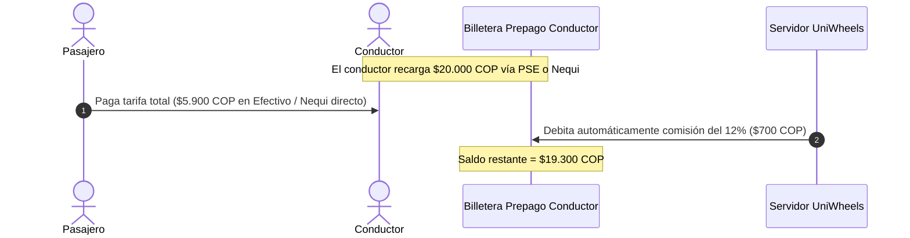

# Especificación de Reglas de Negocio, Tarifas y Políticas — UniWheels

Este documento consolida la lógica de negocio, modelo financiero, cálculo de desvíos y regulaciones de seguridad de la plataforma UniWheels UNAB.

---

## 1. Modelo Financiero y Liquidación de Billetera Prepago

A diferencia de modelos tradicionales con pasarelas de pago con comisiones por transacción individuales que encarecen micropagos, UniWheels opera con un modelo de liquidación prepago:

### 1.1. Estructura de Tarifas
* **Automóviles:**
  * Tarifa base directa: ~$5.000 COP por cupo.
  * Comisión de la plataforma (12%): $600 COP debitados de la billetera del conductor.
  * Ganancia neta del conductor: $4.400 COP por pasajero.
* **Motocicletas:**
  * Tarifa base directa: ~$3.500 COP por cupo (máximo 1 pasajero).
  * Comisión de la plataforma (11.5%): $400 COP debitados de la billetera del conductor.
  * Ganancia neta del conductor: $3.100 COP.
* **Recargo por Desvío Dinámico (Modalidad 2):**
  * Costo adicional por minuto real de desvío: **+$300 COP / min**.
  * Ejemplo: Desvío de 3 minutos -> $3 * $300 = +$900 COP. Tarifa final al pasajero = $5.900 COP.

### 1.2. Límite de Crédito Operativo
* Si el conductor realiza viajes y su saldo en billetera llega a ser negativo, se le permite operar hasta un saldo deudor máximo de **-$5.000 COP**.
* Superado dicho límite, el microservicio bloquea la publicación de nuevas rutas hasta que realice una recarga mínima de saldo.

---

## 2. Algoritmo de Emparejamiento Espacial y Desvíos IA

UniWheels soporta dos modalidades de emparejamiento:

### Modalidad 1: Match Directo en Corredor
* El pasajero se encuentra a menos de **500 metros** a pie del trazado original del conductor.
* No genera tiempo de desvío vehicular. Solo se aplica el tiempo de abordaje (+2 min).

### Modalidad 2: Inserción Dinámica de Desvíos
El motor geoespacial evalúa solicitudes fuera del corredor directo bajo tres condiciones estrictas:
1. **Restricción Dura de Desvío Acumulado:**
   $$\text{Desvío Acumulado} = \sum (\text{Tiempo de Desvío} + 2\text{ min abordaje}) \le 15\text{ minutos}$$
2. **Ventana de Llegada a Clase:**
   $$\text{Hora Estimada de Llegada} = \text{Salida} + \text{Duración Base} + \text{Desvío Acumulado} \le \text{Hora Límite del Conductor}$$
3. **Cupos Disponibles:**
   $$\text{Pasajeros Activos} < \text{Capacidad Vehicular Registrada}$$

---

## 3. Políticas de Cancelación y Penalizaciones

* **Pasajero:**
  * Puede cancelar sin penalización hasta **2 minutos antes** de la hora de salida programada.
  * Si cancela con menos de 2 minutos o no asiste al punto de encuentro (*no show*), se registra una infracción en su historial y una penalización en su índice de confiabilidad.
* **Conductor:**
  * Si ya tiene pasajeros confirmados, debe cancelar con al menos **15 minutos de anticipación**.
  * Cancelaciones tardías no justificadas acarrean suspensión temporal de publicación de rutas por 24 a 72 horas.

---

## 4. Requisitos Vehiculares y Seguridad (Ley 2294 de 2023)

1. **Licencia de Conducción Vigente:** Categoría A2 para motocicletas; B1, B2 o C1 para automóviles.
2. **SOAT Digital:** Obligatorio y vigente en el RUNT.
3. **Tarjeta de Propiedad / Licencia de Tránsito:** A nombre del conductor o con autorización de uso.
4. **Revisión Técnico-Mecánica (RTM):**
   * Obligatoria para automóviles con **más de 5 años** de antigüedad (renovación anual).
   * Obligatoria para motocicletas con **más de 2 años** de antigüedad (renovación anual).
5. **Elemento de Protección para Motos:** Es obligatorio contar con un segundo casco reglamentario certificado con visor y cinta reflectiva para el pasajero.
