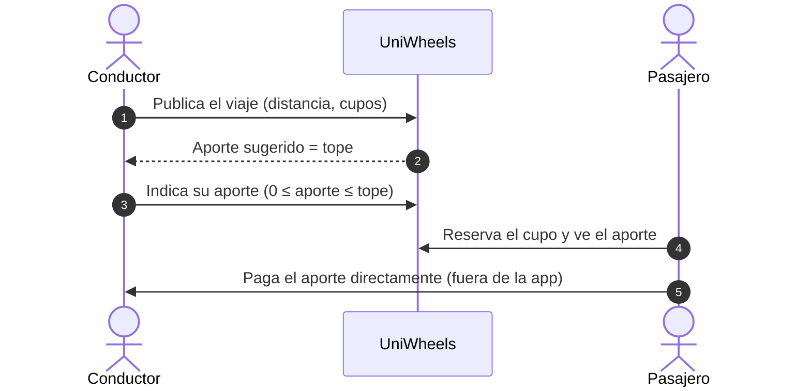

# Especificación de Reglas de Negocio, Aportes y Políticas — UniWheels

Este documento consolida la lógica de negocio, el aporte de gastos compartidos, el cálculo de desvíos y las regulaciones de seguridad de la plataforma UniWheels.

> **Cambio 2026-10-04:** UniWheels ya no procesa pagos ni cobra comisión. Se eliminaron la billetera prepago, la comisión y las penalizaciones en dinero. Ver `docs/adr/0001-pivote-b2b-sin-pagos.md`.

---

## 1. Modelo económico y aporte de gastos compartidos

### 1.1. Quién paga qué
- **La institución** paga la licencia de UniWheels.
- **Los usuarios** (estudiantes, docentes y personal) usan la app gratis.
- **Entre usuarios**, el pasajero puede hacerle al conductor un aporte para compartir los gastos del trayecto. Se paga **directamente** (efectivo, Nequi u otro medio) y **por fuera de la app**.
- **UniWheels no cobra, no recauda y no se queda con ningún porcentaje.**

```mermaid
sequenceDiagram
    autonumber
    actor Conductor
    participant App as UniWheels
    actor Pasajero

    Conductor->>App: Publica el viaje (distancia, cupos)
    App-->>Conductor: Aporte sugerido = tope
    Conductor->>App: Indica su aporte (0 ≤ aporte ≤ tope)
    Pasajero->>App: Reserva el cupo y ve el aporte
    Pasajero->>Conductor: Paga el aporte directamente (fuera de la app)
```

### 1.2. Cálculo del aporte sugerido

$$\text{Aporte por cupo} = \text{APORTE\_BASE} + \text{distancia\_km} \times \text{APORTE\_KM}$$

| Parámetro | Carro | Moto |
|---|---|---|
| `APORTE_BASE` | **$2.000** | **$1.000** |
| `APORTE_KM` | **$400/km** | **$250/km** |

- **Criterio de diseño:** el aporte por cupo queda en **~42–46 % del precio de un Uber individual** para la misma distancia. Referencia de Uber en Colombia: ~$4.000 de banderazo + ~$1.000/km. Es decir, un poco menos de la mitad.
- **`distancia_km`:** la distancia de la ruta publicada por el conductor.
- No depende de cuántos cupos se ofrezcan (la moto siempre tiene 1).
- **Moto:** usa el mismo criterio (~43 % de una app de moto). Las apps de moto (Uber Moto, DiDi Moto, Picap) no publican tarifas por km, así que se usa una referencia **estimada** de ~$2.500 de banderazo + ~$550/km [Supuesto]. Hay que validarla cotizando trayectos reales en Bucaramanga.
- Los parámetros serán configurables por institución cuando exista el modelo de varias universidades. Se revisan cada trimestre frente a las tarifas de las apps.

#### Tabla de referencia: carro

| Trayecto | Aporte por cupo | Uber (viaje completo) | % de Uber | Uber ÷ 3 | Conductor con 3 pasajeros | Costo de operar el carro ($550/km) |
|---|---|---|---|---|---|---|
| 3 km | $3.200 | ~$7.000 | 46 % | ~$2.300 | $9.600 | $1.650 |
| 5 km | $4.000 | ~$9.000 | 44 % | ~$3.000 | $12.000 | $2.750 |
| 8 km | $5.200 | ~$12.000 | 43 % | ~$4.000 | $15.600 | $4.400 |
| 10 km | $6.000 | ~$14.000 | 43 % | ~$4.700 | $18.000 | $5.500 |
| 15 km | $8.000 | ~$19.000 | 42 % | ~$6.300 | $24.000 | $8.250 |
| 20 km | $10.000 | ~$24.000 | 42 % | ~$8.000 | $30.000 | $11.000 |

#### Tabla de referencia: moto

| Trayecto | Aporte | App de moto (estimada) | % de la app | Costo de operar la moto ($200/km) |
|---|---|---|---|---|
| 3 km | $1.800 | ~$4.150 | 43 % | $600 |
| 5 km | $2.300 | ~$5.250 | 44 % | $1.000 |
| 8 km | $3.000 | ~$6.900 | 43 % | $1.600 |
| 10 km | $3.500 | ~$8.000 | 44 % | $2.000 |
| 15 km | $4.800 | ~$10.750 | 45 % | $3.000 |
| 20 km | $6.000 | ~$13.500 | 44 % | $4.000 |

- ⚠️ **Riesgo legal ALTO:** con este esquema el conductor recibe **entre 2,7 y 5,8 veces el costo de operar el trayecto** con el carro lleno, y con un solo pasajero también recibe más que el costo. En moto recibe entre 1,5 y 2,9 veces el costo. Ya no es "compartir gastos", es una **tarifa**. Eso se acerca a la infracción D12 (Ley 769, art. 131: multa y hasta 40 días de inmovilización para el conductor) y debilita el argumento del ADR 0001. **Hay que conseguir un concepto de un abogado antes del lanzamiento.** Si es negativo, se vuelve al esquema de costo compartido: `max($2.000, ⌈km × $550 / cupos⌉₁₀₀)`.
- **Precio frente a grupos:** con este esquema, en todas las distancias sale más caro que 3 personas dividiéndose un Uber. La ventaja para el pasajero solo se mantiene cuando viaja solo.

### 1.3. Aporte indicado por el conductor
- El conductor indica su aporte por cupo: **`0 ≤ aporte ≤ aporte sugerido`**. Puede ofrecer el viaje gratis.
- El backend **rechaza** cualquier aporte mayor al sugerido.
- **Los desvíos no tienen recargo.** La Modalidad 2 limita el desvío acumulado a 15 minutos, y ese costo ya queda dentro de `APORTE_BASE`.

### 1.3.1. Incentivos institucionales para conductores (no monetarios)
Los otorga la institución y se gestionan desde el panel. Son parte del valor de la licencia B2B:
- **Parqueadero preferente o gratuito** para vehículos que lleguen con 2 o más miembros de la comunidad. Es el incentivo con más evidencia a favor (Monash y Newcastle).
- **Horas de bienestar o de servicio social** por viajes compartidos.
- **Reconocimiento:** insignia de "Conductor UniWheels", ranking semestral y certificado de huella de carbono evitada.

### 1.4. Lo que la plataforma no hace
- No confirma ni audita si el aporte se pagó.
- No interviene en los conflictos de pago entre usuarios. Sí se pueden reportar con la calificación o con el soporte de la institución.
- No guarda datos de tarjetas ni de cuentas bancarias.

---

## 2. Algoritmo de emparejamiento espacial y desvíos

UniWheels tiene dos modalidades de emparejamiento.

### Modalidad 1: Match directo en el corredor
* El pasajero está a menos de **500 metros** a pie del trazado original del conductor.
* No genera tiempo de desvío vehicular. Solo se suma el tiempo de abordaje (+2 min).

### Modalidad 2: Inserción dinámica de desvíos
El motor geoespacial evalúa las solicitudes fuera del corredor directo bajo tres condiciones estrictas:
1. **Restricción dura de desvío acumulado:**
   $$\text{Desvío Acumulado} = \sum (\text{Tiempo de Desvío} + 2\text{ min abordaje}) \le 15\text{ minutos}$$
2. **Ventana de llegada a clase:**
   $$\text{Hora Estimada de Llegada} = \text{Salida} + \text{Duración Base} + \text{Desvío Acumulado} \le \text{Hora Límite del Conductor}$$
3. **Cupos disponibles:**
   $$\text{Pasajeros Activos} < \text{Capacidad Vehicular Registrada}$$

---

## 3. Políticas de cancelación (sin penalizaciones en dinero)

* **Pasajero:**
  * Puede cancelar sin consecuencia hasta **2 minutos antes** de la hora de salida programada.
  * Si cancela después de ese límite o no llega al punto de encuentro (*no show*), se registra una **cancelación tardía** en su historial y baja su índice de confiabilidad.
* **Conductor:**
  * Si ya tiene pasajeros confirmados, debe cancelar con al menos **15 minutos de anticipación**. Si cancela después, se registra una **cancelación tardía**.
* **Suspensión automática:**
  * Al acumular **3 cancelaciones tardías en 30 días**, el usuario queda **suspendido 1 mes (30 días)**: no puede publicar ni reservar.
  * Se aplica con el mecanismo de suspensión que ya existe en `UserSuspensionService`. La suspensión se levanta sola al cumplirse el plazo.
  * ⚠️ El umbral de 3 es una propuesta; la duración de 1 mes la decidió el usuario el 2026-10-04.
* La institución, desde el panel de Bienestar, puede ver las cancelaciones tardías y levantar o extender una suspensión.

---

## 4. Requisitos vehiculares y de seguridad (Ley 2294 de 2023)

1. **Licencia de conducción vigente:** categoría A2 para motocicletas; B1, B2 o C1 para automóviles.
2. **SOAT digital:** obligatorio y vigente en el RUNT.
3. **Tarjeta de propiedad o licencia de tránsito:** a nombre del conductor o con autorización de uso.
4. **Revisión técnico-mecánica (RTM):**
   * Obligatoria para automóviles con **más de 5 años** de antigüedad (renovación anual).
   * Obligatoria para motocicletas con **más de 2 años** de antigüedad (renovación anual).
5. **Elemento de protección para motos:** el conductor debe tener un segundo casco reglamentario certificado, con visor y cinta reflectiva, para el pasajero.
