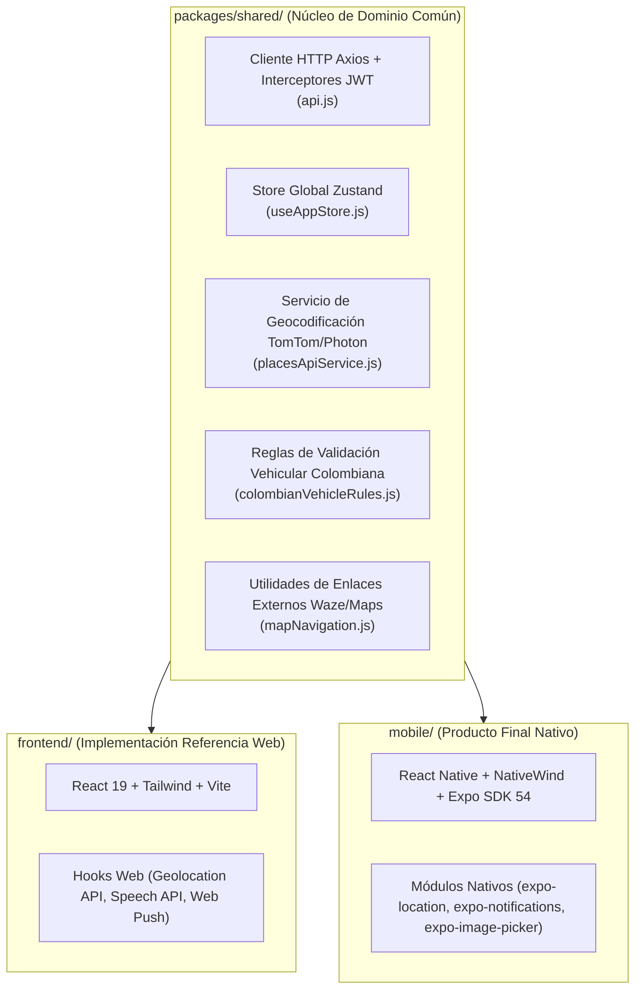
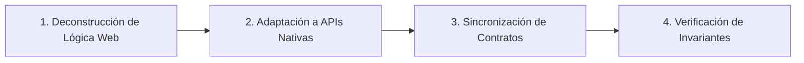

# Metodología de Traducción Fiel y Matriz de Verificación de Paridad Móvil

**Proyecto:** UniWheels — Plataforma de Movilidad Universitaria Compartida  
**Documento:** `specs/mobile-paridad-00-metodologia-verificacion.md`  
**Objetivo:** Establecer el estándar formal, arquitectónico y metodológico para traducir fielmente la lógica de negocio desde la aplicación web de referencia (`frontend/`) hacia la aplicación nativa (`mobile/` en Expo / React Native), garantizando el 100% de paridad de comportamiento y robustez operativa.

---

## 1. Principio Fundamental: SPA Web como Implementación de Referencia

En la nueva estrategia de producto de UniWheels, la distribución final a usuarios finales (estudiantes, conductores y pasajeros) será **100% aplicación móvil nativa** (`mobile/`).

La aplicación web SPA (`frontend/`) no es un producto descartado; cumple el rol de **Implementación de Referencia de la Lógica de Negocio**. En ella ya están resueltos y probados:
1. Máquinas de estado del ciclo de vida del viaje (`solicitado` → `confirmado` → `en_camino` → `en_punto_encuentro` → `recogido` → `completado`).
2. Reglas de validación vehicular colombiana (placas de carro `AAA123`, placas de moto `AAA12D`, fechas de SOAT/RTM no vencidas, casco reglamentario).
3. Flujos criptográficos y de seguridad (doble factor PIN por correo y SMS, verificación de PIN de 4 dígitos en abordaje, tokens de sesión deslizante).
4. Modelos financieros y liquidación (cálculo de tarifa por km, cobro de comisión institucional del 12%, penalización de cancelación de $3.000 COP, integración con pasarela Wompi).
5. Casos borde de exclusión mutua (bloqueo por rol activo si el conductor tiene viaje en curso o el pasajero tiene reserva confirmada).

### Distinción Clave: Lógica Idéntica vs. UI Nativa

* **Lógica de negocio y contratos de API (100% Idéntica):** Mismos endpoints, mismos payloads, mismas validaciones regex, mismos códigos de error HTTP (401, 403, 404, 409, 422), misma persistencia de sesión y mismos cálculos matemáticos/financieros.
* **Capa de Presentación (100% Nativa):** No se realiza un "porting ciego" de elementos web ni emulaciones DOM. Se utilizan componentes primitivos de React Native (`View`, `Text`, `Pressable`, `ScrollView`, `FlatList`), hojas de estilo utilitarias con `NativeWind`, navegación declarativa basada en sistema de archivos (`expo-router`), primitivas táctiles seguras con `react-native-safe-area-context` y animaciones nativas a 60/120 fps con `react-native-reanimated`.

---

## 2. Arquitectura de Código Compartido (`packages/shared/`)

Para evitar duplicación y discrepancias entre plataformas, la lógica desacoplada de la UI debe residir o sincronizarse en `packages/shared/`:



### Reglas de Sincronización del SDK Compartido:
1. **Contratos de API:** Cualquier endpoint nuevo o modificado debe declararse en `packages/shared/src/api.js` con tipado de errores estandarizado:
   ```javascript
   try {
     const response = await client.post(url, data);
     return response.data;
   } catch (error) {
     if (error.response?.data) throw error.response.data;
     throw { message: 'Mensaje genérico de error de conexión.' };
   }
   ```
2. **Estado Global (Zustand):** El store `useAppStore.js` de shared debe mantener paridad en nombres de propiedades, acciones y persistencia (`AsyncStorage` en mobile vs `localStorage` en web mediante un adaptador de almacenamiento unificado).

---

## 3. Protocolo de Portabilidad Paso a Paso

Cada desarrollador o agente que porte una pantalla o flujo de `frontend/` a `mobile/` debe ejecutar estrictamente las siguientes 4 fases:



### Fase 1: Deconstrucción y Extracción de Invariantes
- Inspeccionar el componente web de referencia.
- Extraer la lista exhaustiva de:
  - Estados locales (`useState`, `useReducer`).
  - Efectos secundarios (`useEffect`, suscripciones, intervalos).
  - Validaciones de entrada (longitud, caracteres especiales, formato, rangos numéricos).
  - Respuestas del backend y manejo de errores (códigos 400/404/409/422).
  - Casos de carreras o bloqueos de doble click (`isSubmitting`, `isLoading`).

### Fase 2: Adaptación de APIs Web a Primitivas Nativas Expo

| API o Mecanismo en Web (`frontend/`) | Reemplazo Nativo Obligatorio en Mobile (`mobile/`) | Justificación / Consideración Técnica |
| :--- | :--- | :--- |
| `navigator.geolocation.watchPosition` | `expo-location` (`watchPositionAsync` / `startLocationUpdatesAsync`) | Manejo de permisos en primer y segundo plano con Android Foreground Services e iOS Location Background Modes. |
| `<input type="file">` / Drag & Drop | `expo-image-picker` (`launchImageLibraryAsync` / `launchCameraAsync`) | Acceso a galería y cámara respetando permisos de Android (`READ_MEDIA_IMAGES`) e iOS (`NSPhotoLibraryUsageDescription`). |
| `window.open('https://waze.com/...')` | `expo-linking` (`Linking.openURL`) | Esquemas de URL nativos (`waze://`, `google.navigation:`, `maps://`) con fallback a HTTP. |
| `window.speechSynthesis` | `expo-speech` (`Speech.speak`) o HUD Visual | Sintetizador de voz del sistema operativo del dispositivo. |
| `window.localStorage` | `@react-native-async-storage/async-storage` | Almacenamiento asíncrono no volátil en SQLite/KV nativo. |
| `<canvas>` (Firma táctil) | Componente táctil SVG / PanResponder (`react-native-svg`) | Captura de trazos vectoriales de firma digital de autorización. |
| Web Push (Service Worker + VAPID) | `expo-notifications` (FCM v1 / APNs) | Registro de device token y recepción de notificaciones nativas en segundo plano y app cerrada. |
| CSS Animations / Framer Motion | `react-native-reanimated` (v3/v4) | Animaciones ejecutadas en el hilo de UI (hilo nativo) sin saturar el puente JavaScript. |

### Fase 3: Implementación de UI Nativa con NativeWind
- Construir vistas adaptativas utilizando `SafeAreaView` o `useSafeAreaInsets()`.
- Implementar `KeyboardAvoidingView` con `behavior={Platform.OS === 'ios' ? 'padding' : 'height'}` en todos los formularios para prevenir que el teclado oculte campos o botones de acción.
- Mantener consistencia con el sistema de diseño oscuro/claro (`dark:` classes).

### Fase 4: Verificación y Cierre contra la Matriz de Invariantes
- Ejecutar la batería de pruebas de comportamiento definida en la sección 4.
- Verificar que las pruebas automatizadas (lint, types, tests unitarios) pasen al 100%.

---

## 4. Matriz y Checklist de Verificación de Paridad Funcional

Cada especificación técnica debe incluir una **Matriz de Verificación de Comportamiento** que compare punto por punto los resultados esperados entre la web de referencia y la app móvil.

### Estándar de Matriz por Módulo / Feature:

```markdown
| ID Prueba | Caso de Uso / Flujo | Entrada / Acción | Comportamiento Esperado en Web | Comportamiento Esperado en Mobile | ¿Paridad 100%? |
| :--- | :--- | :--- | :--- | :--- | :---: |
| CP-01 | Validación formato placa carro | Ingresar "abc-123" | Normaliza a "ABC123", pasa validación regex | Normaliza a "ABC123", pasa validación regex | [ ] |
| CP-02 | Validación formato placa moto | Ingresar "abc12d" | Normaliza a "ABC12D", pasa validación regex | Normaliza a "ABC12D", pasa validación regex | [ ] |
| CP-03 | Documento SOAT vencido | Fecha `2020-01-01` | Muestra error "Documento vencido", bloquea botón | Muestra error "Documento vencido", bloquea botón | [ ] |
| CP-04 | Intento de doble envío | Tap rápido 3 veces en "Confirmar" | Deshabilita botón, ejecuta 1 sola petición POST | Deshabilita botón, ejecuta 1 sola petición POST | [ ] |
| CP-05 | Error 422 de backend | Backend responde `cupos > 4` | Muestra Toast/Banner con mensaje exacto del servidor | Muestra Toast/Banner nativo con mensaje exacto del servidor | [ ] |
| CP-06 | Sesión expirada (401) | Ejecutar acción con JWT vencido | Intenta refresh token proactivo; si falla, redirige a Login | Intenta refresh token en interceptor; si falla, borra storage y redirige a Welcome | [ ] |
| CP-07 | Pánico SOS activo | Presionar botón SOS en cabecera | Abre modal con tel:123, tel:125 y WhatsApp con link maps | Abre modal nativo con Linking tel:123, tel:125 y WhatsApp con coordenadas | [ ] |
```

### Checklist Universal de Calidad Mobile (Criterios de Aceptación Obligatorios)

Para dar por aprobada cualquier tarea de paridad en mobile, se debe verificar el cumplimiento de los siguientes 8 puntos de control:

- [ ] **1. Consistencia de Contrato:** El payload enviado al backend es idéntico byte a byte (o clave a clave) al enviado por el cliente web.
- [ ] **2. Manejo de Errores de Red:** Si se corta la conexión (modo avión o error 500), la app muestra un estado vacío amigable con botón de reintentar, sin crashear ni congelar la interfaz.
- [ ] **3. Feedback Táctil y Estados de Carga:** Todos los botones de acción principal tienen estado deshabilitado + indicador de carga (`ActivityIndicator`) durante peticiones asíncronas.
- [ ] **4. Comportamiento del Teclado:** El teclado no tapa ningún input ni el botón de confirmación; al tocar fuera del teclado se cierra (`TouchableWithoutFeedback` + `Keyboard.dismiss`).
- [ ] **5. Manejo Seguro de Permisos:** Si el usuario rechaza permisos de Cámara, Galería o Ubicación, la app no se cierra abruptamente; presenta una alerta explicativa con opción de abrir la configuración del sistema (`Linking.openSettings()`).
- [ ] **6. Ciclo de Vida en Segundo Plano:** Las tareas críticas (ej. emisión de GPS en conductor) no se detienen si el usuario bloquea la pantalla o cambia momentáneamente de app.
- [ ] **7. Paridad Visual y Tipográfica:** Uso correcto de espaciados, tokens de color (Slate, Emerald, Amber, Rose, Indigo) y soporte completo para modo oscuro (`dark`).
- [ ] **8. Limpieza de Memoria y Timers:** Todos los `setInterval`, `watchPositionAsync` y suscripciones de eventos se desuscriben en la función de limpieza del `useEffect` al desmontar el componente.

---

## 5. Aplicabilidad

Este estándar rige para todas las especificaciones de paridad existentes y futuras:
* `specs/mobile-paridad-01-roles-navegacion.md`
* `specs/mobile-paridad-02-flujo-conductor.md`
* `specs/mobile-paridad-03-pasajero-matching-viaje.md`
* `specs/mobile-paridad-04-gps-tracking-sos.md`
* `specs/mobile-paridad-05-push-notificaciones.md`
* `specs/mobile-paridad-06-build-eas-tiendas.md`
* `specs/mobile-paridad-07-decision-panel-bienestar.md`
* `specs/mobile-paridad-08-infraestructura-backend.md`
