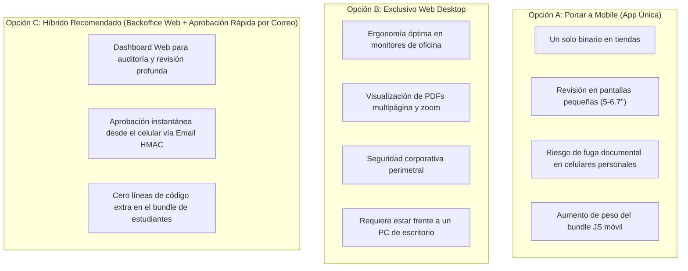

# Documento de Decisión Arquitectónica (ADR): Panel de Administrador de Bienestar Universitario en Estrategia 100% Móvil

**Proyecto:** UniWheels — Plataforma de Movilidad Universitaria Compartida  
**Documento:** `specs/mobile-paridad-07-decision-panel-bienestar.md`  
**Fecha:** 2026-09-22  
**Autor:** Antigravity (Gemini)  
**Estado:** Aceptado (2026-09-22) — Opción C ratificada. Verificado contra código real: el mecanismo de aprobación HMAC por correo en `VehicleController.php` existe y funciona como se describe, aunque el token no expira ni es de un solo uso (es determinístico por diseño; no afecta la decisión ya que aprobar/rechazar dos veces es idempotente). Las 3 acciones de la sección 5 ya estaban satisfechas sin cambios de código.

---

## 1. Contexto y Planteamiento del Problema

Bajo la nueva estrategia corporativa de UniWheels, **el producto final distribuido a la comunidad universitaria es 100% aplicación móvil nativa** (Expo / React Native para iOS y Android). La aplicación web SPA (`frontend/`) pasa a ser la implementación de referencia para la lógica de negocio.

En la SPA web actual existe el módulo `AdminVehicleReviewView.jsx` (líneas 1-329), exclusivo para usuarios con rol `administrador` (personal de Bienestar Universitario / Seguridad Institucional). Este módulo permite:
- Listar solicitudes vehiculares pendientes de validación.
- Descargar y visualizar documentos legales sensibles (SOAT, Licencia de Conducción, Tarjeta de Propiedad y Revisión Técnico-Mecánica) en formato PDF o imagen de alta resolución mediante URLs firmadas con token JWT temporal.
- Comparar números de póliza, fechas de vencimiento y categorías de licencia.
- Aprobar o rechazar documentos con notas de retroalimentación hacia el estudiante conductor (`PATCH /vehicles/{id}/documents/{dId}/verify`).
- Registrar bitácora de auditoría de acceso documental para cumplimiento de la Ley 1581 de 2012 (Habeas Data).

### La Pregunta de Decisión:
¿Debe portarse este panel administrativo a una pestaña/pantalla dentro de la aplicación móvil Expo (`mobile/`), o debe mantenerse exclusivamente en la plataforma Web / Backoffice de escritorio?

---

## 2. Evaluación Comparativa de Alternativas

### Análisis Detallado por Opción:

| Criterio de Evaluación | Opción A: Portar Panel a Mobile | Opción B: Exclusivo Web SPA | Opción C: Arquitectura Híbrida (Recomendada) |
| :--- | :--- | :--- | :--- |
| **1. Ergonomía de Revisión Documental** | 🔴 **Muy deficiente.** Leer letras pequeñas de pólizas SOAT y certificados RTM en pantallas de 6" genera fatiga visual y alta probabilidad de error humano en la validación de fechas/números. | 🟢 **Excelente.** Monitores de oficina (1080p/4K) permiten ver el PDF completo en una mitad de pantalla y el formulario de validación en la otra. | 🟢 **Excelente.** Auditoría formal en pantalla grande; vista previa en correo para casos urgentes. |
| **2. Perfil de Usuario y Entorno Laboral** | 🔴 **Desalineado.** Los funcionarios de Bienestar Universitario trabajan en horario de oficina desde sus escritorios asignados en la universidad. | 🟢 **Alineado.** El personal administrativo opera naturalmente en navegadores web de escritorio (Chrome, Edge) con teclado y ratón. | 🟢 **Alineado.** Cubre tanto la jornada de oficina como guardias/revisiones rápidas fuera de sede. |
| **3. Seguridad y Protección de Datos (Ley 1581)** | 🔴 **Riesgo alto.** Descargar y almacenar en caché PDFs de licencias y tarjetas de propiedad de estudiantes en teléfonos personales de empleados universitarios. | 🟢 **Seguro.** Sesiones corporativas en estaciones de trabajo institucionales dentro de la red UNAB. | 🟢 **Muy seguro.** URLs firmadas con expiración estricta y tokens criptográficos HMAC de un solo uso. |
| **4. Impacto en el Bundle Móvil de Estudiantes** | 🔴 **Negativo.** Agrega dependencias de visualización de PDFs (`react-native-pdf`, `react-native-blob-util`), lógica de moderación y pantallas muertas para el 99.9% de usuarios. | 🟢 **Cero impacto.** La app móvil se mantiene ligera, rápida y 100% enfocada en el viaje estudiantil. | 🟢 **Cero impacto.** La app móvil de estudiantes permanece limpia. |
| **5. Costo de Desarrollo y Mantenimiento** | 🔴 **Alto.** Requiere construir un visor PDF nativo, manejo de rotación de pantalla y gestión de roles admin en Expo Router. | 🟢 **Cero costo adicional.** `AdminVehicleReviewView.jsx` ya está construido, probado y funcionando al 100%. | 🟢 **Mínimo.** Aprovecha el sistema de correos HMAC ya programado en `VehicleController.php`. |

---

## 3. Hallazgo Técnico en el Backend: La Infraestructura de Aprobación Móvil ya Existe

Al inspeccionar el código real de `services/vehicle-service/app/Http/Controllers/Api/V1/VehicleController.php` (líneas 102-111 y 213-254), se descubrió que el backend **ya cuenta con un mecanismo seguro de aprobación remota móvil sin necesidad de app**:

1. Cuando un estudiante sube sus documentos en el wizard de conductor, el backend envía un correo institucional a Bienestar (`SolicitudVehiculoAdminMail.php`).
2. El correo incluye fotos de los documentos y dos botones con tokens criptográficos HMAC SHA-256 (`$tokenAprobacion` y `$tokenRechazo` generados con la `APP_KEY` del backend).
3. Si el funcionario de Bienestar está fuera de su oficina y recibe el correo en su celular, **puede tocar "Aprobar Vehículo" o "Rechazar Vehículo" directamente desde su cliente de correo móvil** (Outlook/Gmail).
4. El backend procesa la petición en `GET /api/v1/vehicles/{id}/status?action=approve&token={token}`, valida la firma criptográfica en tiempo constante (`hash_equals`) y aprueba el vehículo al instante.

---

## 4. Decisión Técnica Recomendada

### Veredicto: Mantener el Panel Administrativo en Web SPA y Aprovechar la Aprobación Móvil por Correo HMAC (Opción C).

**Fundamentación Técnica:**
1. **Separación de Audiencias:** La aplicación móvil de UniWheels (`mobile/`) debe ser un producto de consumo de alto rendimiento, optimizado exclusivamente para la experiencia rápida y segura de **Estudiantes Pasajeros y Conductores**. Introducir herramientas de backoffice institucional en la app móvil degrada la experiencia de usuario y añade superficie de ataque innecesaria.
2. **Eficiencia Operativa:** La revisión rigurosa de documentos legales vehiculares exige pantallas de escritorio para verificar firmas y sellos contra bases de datos del RUNT.
3. **Respuesta Rápida Cubierta:** Para situaciones donde el administrador requiere aprobar una solicitud de inmediato desde su teléfono, el mecanismo de tokens HMAC por correo ya implementado en el backend brinda respuesta en un clic sin requerir ninguna pantalla adicional en mobile.

---

## 5. Acciones a Tomar

1. **En `mobile/`:**
   - Mantener el alcance de la app móvil enfocado 100% en los roles `Pasajero` y `Conductor`.
   - Si un usuario con rol `administrador` inicia sesión en mobile, la app le otorgará la vista estándar de pasajero (puede usar el servicio como cualquier miembro de la comunidad).
2. **En `frontend/`:**
   - Conservar `AdminVehicleReviewView.jsx` como la consola administrativa oficial de escritorio para el equipo de Bienestar Universitario, desplegada en `https://uniwheels.org/admin` o mediante el acceso web de la universidad.
3. **En Backend:**
   - Mantener intacto el flujo de notificación por correo con tokens HMAC en `vehicle-service`.
